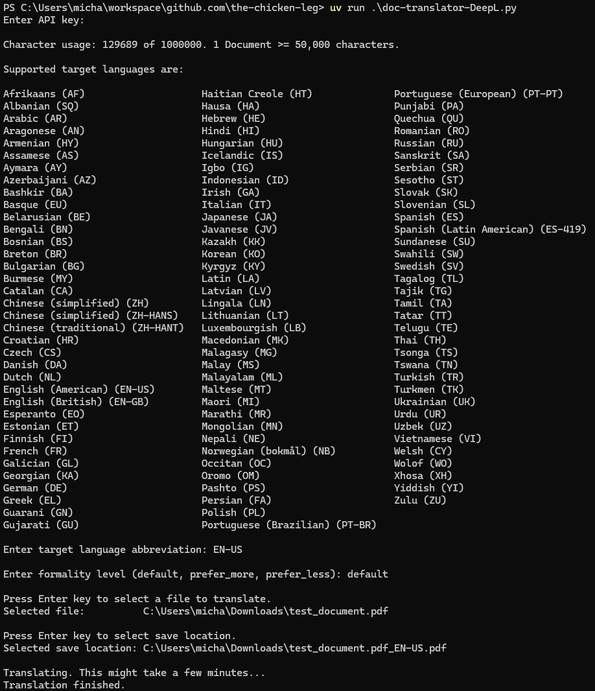

# doc-translator-DeepL

This Python script uses the DeepL API to translate a document.

## Usage



## Run on Windows with uv

1. Install uv using PowerShell (full instructions here: https://docs.astral.sh/uv/getting-started/installation):

```powershell
powershell -ExecutionPolicy ByPass -c "irm https://astral.sh/uv/install.ps1 | iex"
```

2. Verify uv installed correctly:

```powershell
uv --version
```

3. Download script file:

```powershell
curl -L -O https://github.com/the-chicken-leg/doc-translator-DeepL/blob/main/doc-translator-DeepL.py?raw=true
```

4. Run using uv. On the first run, uv will download the appropriate Python version, create a virtual environment, and install dependencies, which might take some time. Subsequent runs will be faster:

```powershell
uv run .\doc-translator-DeepL.py
```
